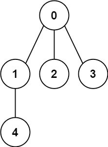
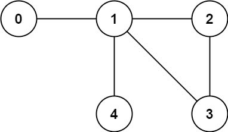

You have a graph of n nodes labeled from 0 to n - 1. You are given an integer n and a list of edges where edges[i] = [ai, bi] indicates that there is an undirected edge between nodes ai and bi in the graph.

Return true if the edges of the given graph make up a valid tree, and false otherwise.

example 1:

    

```
Input: n = 5, edges = [[0,1],[0,2],[0,3],[1,4]]
Output: true
```

example 2:



```
Input: n = 5, edges = [[0,1],[1,2],[2,3],[1,3],[1,4]]
Output: false
```

Constraints:

    1 <= n <= 2000
    0 <= edges.length <= 5000
    edges[i].length == 2
    0 <= ai, bi < n
    ai != bi
    There are no self-loops or repeated edges.

---

Approach 1:

An undirected graph is tree if it has following properties.

- There is no cycle.
- The graph is connected.